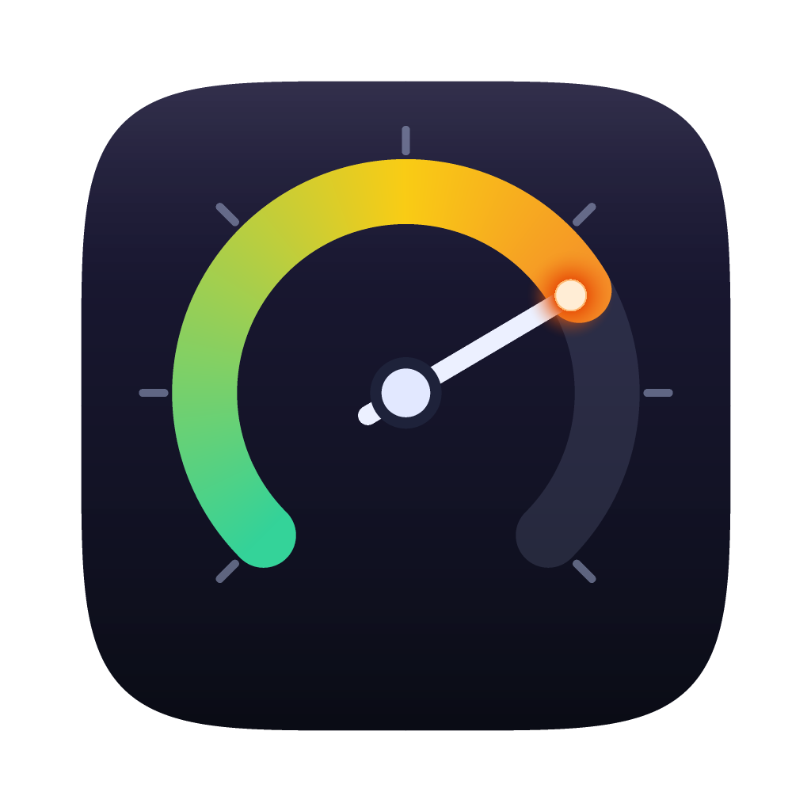
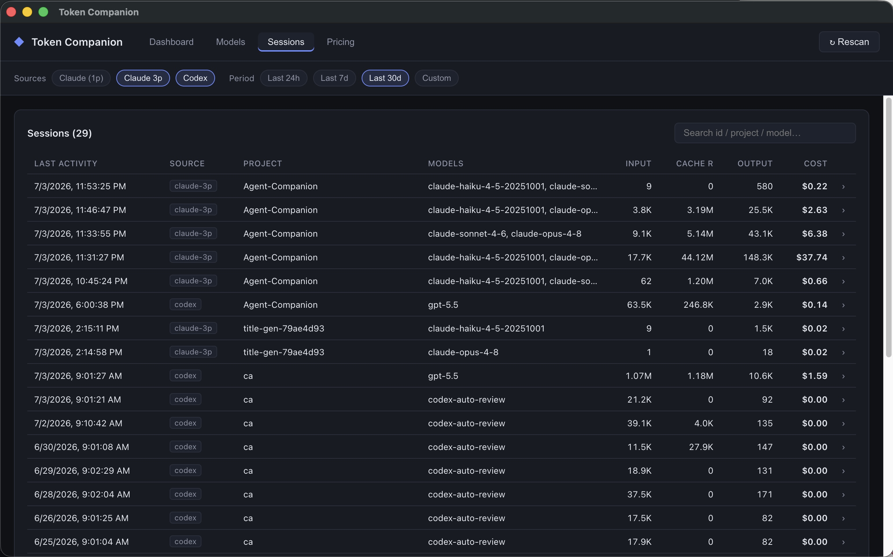

<div align="center">



# Token Companion

**See exactly what your AI coding sessions cost.**

Local, privacy-first desktop analytics for Claude and Codex usage records already on disk.

[](https://github.com/pzarzycki/token-companion/releases)
[](https://github.com/pzarzycki/token-companion/actions)
[](LICENSE)
[](https://pzarzycki.github.io/token-companion/)

[Install](#install) · [Documentation](https://pzarzycki.github.io/token-companion/) · [What it reads](#what-it-reads) · [Building](#building-from-source)



</div>

## Highlights

- 100% local. No accounts, no telemetry, no cloud sync.
- Exact token counts from real usage records, not estimates.
- Editable per-model pricing in the app.
- One view across Claude CLI, Claude Desktop agent modes, VS Code, and Codex CLI.
- Session, model, and project-folder attribution.

## Install

There are two normal install paths:

1. Download the latest release artifact for your platform.
2. Build locally from source with `npx`.

### Option 1: direct download

Current release: `v0.1.4`

- macOS ARM64 DMG: [Token.Companion-0.1.4-mac-arm64.dmg](https://github.com/pzarzycki/token-companion/releases/download/v0.1.4/Token.Companion-0.1.4-mac-arm64.dmg)
- Windows x64 installer: [Token.Companion-0.1.4-win-x64.exe](https://github.com/pzarzycki/token-companion/releases/download/v0.1.4/Token.Companion-0.1.4-win-x64.exe)
- Linux amd64 DEB: [Token.Companion-0.1.4-linux-amd64.deb](https://github.com/pzarzycki/token-companion/releases/download/v0.1.4/Token.Companion-0.1.4-linux-amd64.deb)
- Linux x86_64 RPM: [Token.Companion-0.1.4-linux-x86_64.rpm](https://github.com/pzarzycki/token-companion/releases/download/v0.1.4/Token.Companion-0.1.4-linux-x86_64.rpm)
- Checksums: [SHA256SUMS](https://github.com/pzarzycki/token-companion/releases/download/v0.1.4/SHA256SUMS)

Warning:

- macOS builds are unsigned and not notarized. Gatekeeper may block first launch. If it does, open the app from Finder with control-click -> `Open`, or allow it in System Settings.
- Windows builds are unsigned unless the GitHub Actions runner is given `WINDOWS_SIGNING_CERT_BASE64` and `WINDOWS_SIGNING_CERT_PASSWORD` secrets. A self-signed certificate will sign the binary, but SmartScreen will still show `More info` -> `Run anyway` unless the certificate chains to a trusted publisher.
- Linux packages are convenience artifacts, not signed distro packages. Verify `SHA256SUMS` before installing.

### Option 2: build locally with `npx`

Prerequisite: Node.js 24 LTS or newer. `npm` and `npx` are included with the standard Node.js install. Install Node.js from https://nodejs.org/en/download if `npx` is missing.

```bash
npx token-companion@latest
```

Useful flags:

```bash
npx token-companion@latest --dry-run
npx token-companion@latest --version v0.1.4
```

- `--dry-run`: print checks, build commands, and install target.
- `--package-only`: build packages but do not copy or install the built app.
- `--install-dir <path>`: macOS `.app` destination. Windows uses one-click NSIS install and rejects this option.

What the npm package actually is:

- `token-companion` on npm is a small bootstrapper package, not the Electron app bundle and not the full source tree.
- `npx token-companion@latest` downloads the matching GitHub source tag, runs the checked-in installer, builds the app locally, and then installs the built desktop app for the current OS.
- The npm package exists to give users a one-line entry point with normal npm tooling while keeping the app itself open-source and locally built.

Install details: [docs](https://pzarzycki.github.io/token-companion/install/).

## What it reads

| Source | Location | Token data |
|---|---|---|
| Claude CLI + Claude Desktop agent modes + VS Code | `~/.claude/projects/**/*.jsonl` | Per-message `usage` |
| Claude 3p title-gen | `~/Library/Application Support/Claude-3p/title-gen/**/*.jsonl` | Usage records |
| Codex CLI | `~/.codex/sessions/**/*.jsonl` | Last cumulative `token_count` per session |
| Claude/Codex desktop plain chat | IndexedDB / LevelDB stores | Discovery only; no token counts exposed |

Validation rules in `scripts/verify.mjs`:

- Claude usage is summed per assistant message and deduplicated on `message.id`.
- Codex totals are taken from the last cumulative session snapshot, never summed across events.

## Building From Source

Token Companion uses [Electron Forge](https://www.electronforge.io/) for development packaging, [electron-builder](https://www.electron.build/) for release artifacts, React 19, Astro 7 for docs, and TypeScript 6. Builds are platform-local because `classic-level` is a native dependency and the distributables are OS-specific.

### Prerequisites

- Node.js 24 LTS or newer with npm and npx
- macOS: Xcode Command Line Tools
- Linux: `build-essential`, Python 3, `fakeroot`, and `rpm`

The source installer checks these prerequisites before building. It fails with the original command output if dependency install, typecheck, or packaging fails.

### Install

```bash
git clone https://github.com/pzarzycki/token-companion.git
cd token-companion
npm install
```

The repo pins npm's cache to a local `.npm-cache/` directory to avoid Windows profile-cache permission issues during install.

### Development

```bash
npm run typecheck
npm run dev
```

### Build

```bash
# Package the current OS without making installers
npm run package

# Build current-platform distributables with electron-builder
npm run dist

# Platform-specific distributable commands when you are on that OS
npm run dist:mac
npm run dist:win
npm run dist:linux
```

Backward-compatible aliases remain available: `npm run make`, `npm run make:mac`, `npm run make:win`, and `npm run make:linux`.

Packaged app output lands in `out/`. Final distributables land in `out/dist/`.

Packaging targets:

- macOS: `dmg` + `zip`
- Windows: NSIS installer `.exe`
- Linux: `deb` + `rpm`

### Verify

```bash
npm run verify
npm run audit:prod
npm run audit
```

`npm run verify` validates parser and pricing logic against local Claude/Codex data. It is for contributors and maintainers, not part of the end-user installer path.

## Release And Publish

The release source of truth is a version tag on `main`.

Versioning rules:

- Keep the desktop app version in the root [package.json](package.json) aligned with the installer package version in [packages/npm-installer/package.json](packages/npm-installer/package.json).
- Create one tag per real release: `vX.Y.Z`.
- Do not publish from an untagged commit if you want `npx token-companion` to resolve a matching source tarball cleanly.

Steady-state release flow:

1. Update `package.json`, `package-lock.json`, `packages/npm-installer/package.json`, and `packages/npm-installer/package-lock.json` to the same `X.Y.Z`.
2. Merge the release commit to `main`.
3. Push `main`.
4. Create and push tag `vX.Y.Z`.
5. GitHub Actions runs `.github/workflows/build.yml`.
6. The workflow verifies that the tag matches both package versions.
7. The workflow builds platform artifacts, publishes the GitHub Release, and publishes `packages/npm-installer` to npm through Trusted Publishing.

Trusted Publishing setup:

- npm package: `token-companion`
- Publisher: `GitHub Actions`
- GitHub owner: `pzarzycki`
- Repository: `token-companion`
- Workflow filename: `build.yml`
- Allowed action: `Allow npm publish`

Why the installer downloads GitHub source:

- The published npm package intentionally stays small and only contains the installer entry point.
- The real application source is taken from the matching GitHub tag tarball such as `https://github.com/pzarzycki/token-companion/archive/refs/tags/v0.1.4.tar.gz`.
- This keeps the published npm artifact small, makes the release source explicit, and ensures the local build uses the same tagged source as the GitHub release.

Recovery path:

- Manual `npm publish` should be treated as recovery-only when fixing publishing setup.
- Normal releases should come from the tag-triggered GitHub Actions workflow so npm, GitHub Release artifacts, and the source tag stay aligned.

## Security Posture

- Full `npm audit` and production-only `npm audit --omit=dev` are expected to pass clean on a fresh install.
- The packaged app enables Electron fuses, uses `contextIsolation`, runs the renderer sandboxed, and denies browser permission requests by default.
- The preload bridge exposes a small typed API only, and session-entry IPC now rejects file paths outside the known Claude/Codex session roots.

### Regenerate icons

```bash
python scripts/gen_icon.py
```

This writes `resources/icon.png`, `resources/icon.icns`, and `resources/icon.ico`.

## Pricing

Default rates live in [resources/pricing.default.json](resources/pricing.default.json). They are bundled into the app and copied to `<userData>/pricing.json` on first run, which the in-app Pricing tab edits. OpenAI / Codex entries marked `verify` should be confirmed before relying on totals.

## Architecture

```text
src/
├── main/      Electron main process: scanning, parsing, pricing persistence, IPC
├── preload/   Typed contextBridge API
├── renderer/  React UI
└── shared/    Shared types and pure aggregation logic
```

## Known Gaps

- Plain desktop-chat stores are detected but not yet costed because they do not expose token usage directly.
- Some OpenAI / Codex pricing defaults are still placeholders.

## License

[MIT](LICENSE)

<div align="center">
<sub>Built with Electron, Electron Forge, webpack, React, and TypeScript.</sub>
</div>
