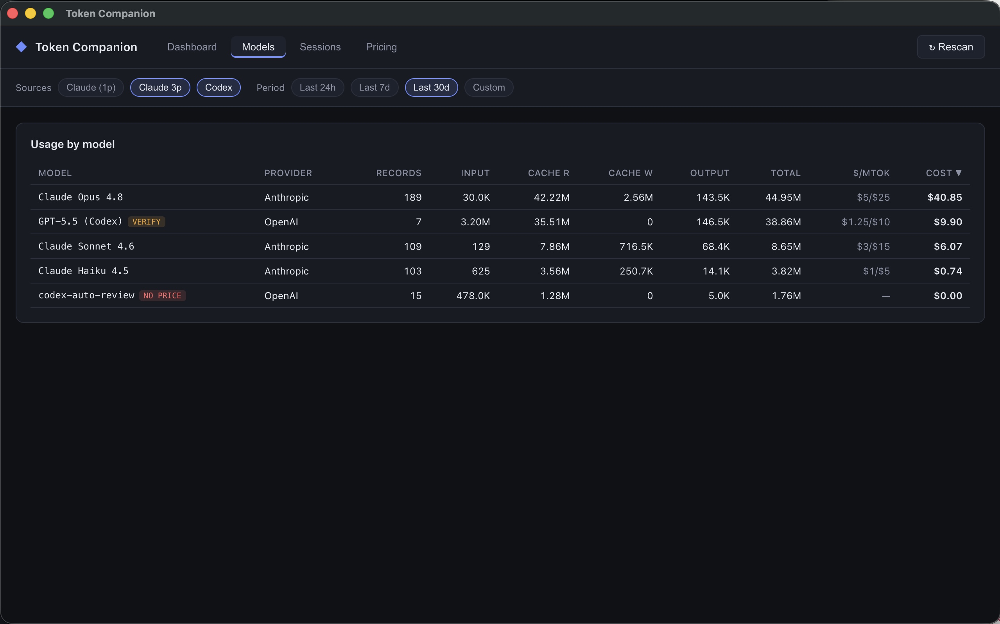
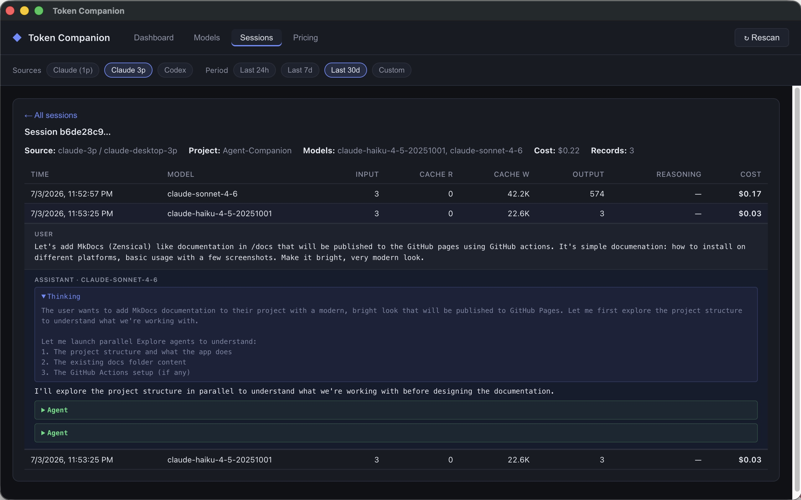
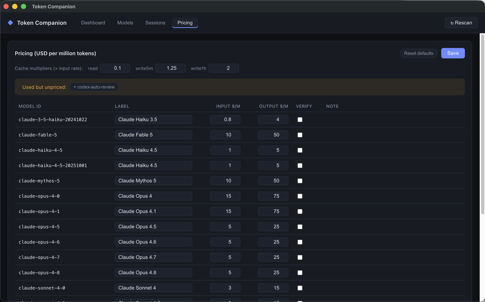

# Features

## Dashboard overview

The Dashboard is the first thing you see on launch. It gives a full-picture cost summary for all scanned sessions.

**Summary cards** show at a glance:

- **Total Cost** — sum of all computed costs across all sources and models
- **Total Tokens** — all token types combined (input + output + cache-read + cache-write + reasoning)
- **Sessions** — number of distinct session files processed
- **Models** — unique model identifiers encountered

Use the **filter bar** (date range + source chips) to narrow the summary to a specific window or data source — the cards update immediately.

## Model breakdown

The **Models** tab shows a table of every model encountered, sorted by total cost descending:

| Column | Description |
|---|---|
| Model | Model identifier as recorded in the session file |
| Input | Input tokens (prompt) |
| Output | Output tokens (completion) |
| Cache read | Tokens read from the prompt cache |
| Cache write | Tokens written to the prompt cache |
| Reasoning | Extended thinking / reasoning tokens (where applicable) |
| Cost | Computed cost in USD based on current pricing |

Models with no matching pricing entry show **$0.00** and are flagged with a warning indicator. Add their rates in the Pricing tab to include them in the total.

## Session list & drilldown

The **Sessions** tab lists every session file scanned, with its source, model (or top model if mixed), total tokens, total cost, and the working directory (`cwd`) where the agent was run.

Click any row to expand it and see individual conversation entries — user messages, assistant replies, tool calls, and thinking blocks. Each entry shows its own token breakdown.

The `cwd` field is particularly useful for tracing costs back to a specific project directory: it reflects where Claude or Codex was invoked when that session was created.

## Date range & source filtering

The **filter bar** at the top of every tab lets you scope the data:

**Date presets** — Last 7 days, Last 30 days, All time. These update all tabs simultaneously.

**Source chips** — toggle between `claude`, `claude-3p`, and `codex` to isolate a specific agent's usage. Multiple sources can be active at once.

Filters persist while the app is open; click **↻ Rescan** to re-read files without resetting filters.

## Pricing editor

The **Pricing** tab shows every model's rate card. All values are editable:

| Field | Description |
|---|---|
| Input ($/MTok) | Cost per million input tokens |
| Output ($/MTok) | Cost per million output tokens |
| Cache read mult. | Multiplier applied to the base input rate for cache-read tokens |
| Cache write mult. | Multiplier applied to the base input rate for cache-write tokens |

Changes are saved to `<userData>/pricing.json` and survive app restarts. The bundled defaults come from `resources/pricing.default.json` in the app bundle.

To add a model not in the list, type its exact ID (as it appears in the Models tab) into the new-model field and set its rates.

!!! note "Codex / OpenAI pricing"
    The built-in Codex pricing entries are approximate and marked **verify** — official OpenAI token pricing should be confirmed against the [OpenAI pricing page](https://openai.com/api/pricing/) and updated in the editor.

## Deduplication

Claude writes a cumulative record for each message exchange, which means long sessions contain many overlapping entries. Token Companion deduplicates Claude records using the `message.id` field — only the final record for each unique message ID is counted, so resuming a session does not inflate the totals.

Codex sessions work differently: each session file contains a sequence of cumulative usage snapshots. Token Companion takes only the **last** record in each session file to avoid double-counting.

## Untracked conversations

The **Untracked Conversations** panel (shown on the Dashboard when relevant) lists apps that were detected on your machine but whose session stores cannot be parsed for token usage:

- **Claude Desktop** (plain chat) — stores conversations in an IndexedDB/LevelDB binary format with no `usage` records
- **Codex Desktop** — same situation

The panel shows how many conversations were found in those stores so you have visibility into the gap, even though the tokens cannot be counted yet. Support for these sources is on the roadmap.
